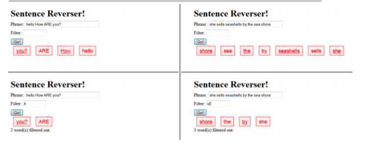

# JS-Basics-Questions
Questions that helps to apply the basics of javascript

Questions

SECTION I. Functions

1. Write a JavaScript function that reverse a number.  
Example x = 32243;
Expected Output : 34223 

2. Write a JavaScript function that checks whether a passed string is palindrome or not?  
A palindrome is word, phrase, or sequence that reads the same backward as forward, e.g., madam or nursesrun.

3. Write a JavaScript function that generates all combinations of a string 
Example string : 'dog' 
Expected Output : d,do,dog,o,og,g 

4. Write a JavaScript function that returns a passed string with letters in alphabetical order.
 Example string : 'webmaster' 
Expected Output : 'abeemrstw'
Assume punctuation and numbers symbols are not included in the passed string.

5. Write a JavaScript function that accepts a string as a parameter and converts the first letter of each word of the string in upper case. 
 Example string : 'the quick brown fox' 
Expected Output : 'The Quick Brown Fox '

6. Write a JavaScript function that accepts a string as a parameter and find the longest word within the string. 
Example string : 'Web Development Tutorial' 
Expected Output : 'Development'

7. Write a JavaScript function that accepts a string as a parameter and counts the number of vowels within the string. 
Note : As the letter 'y' can be regarded as both a vowel and a consonant, we do not count 'y' as vowel here. 
Example string : 'The quick brown fox' 
Expected Output : 5

8. Write a JavaScript function which will take an array of numbers stored and find the second lowest and second greatest numbers, respectively.
 Sample array : [1,2,3,4,5]
Expected Output : 2,4 

9. Write a JavaScript function to compute the factors of a positive integer. 

10. Write a JavaScript function to compute the value of bn where n is the exponent and b is the bases. Accept b and n from the user and display the result.

11. Write a JavaScript function to extract unique characters from a string. Example string : "thequickbrownfoxjumpsoverthelazydog"
Expected Output : "thequickbrownfxjmpsvlazydg"

12. Write a JavaScript function to get the number of occurrences of each letter in specified string.
Example String: The meeting is done
Example out: T=2,h=1,e=4,….

 13. Write a function for searching JavaScript arrays with a binary search.
 Note : A binary search searches by splitting an array into smaller and smaller chunks until it finds the desired value.

14. Write a JavaScript function that accepts two arguments, a string and a letter and the function will count the number of occurrences of the specified letter within the string. 
Sample arguments : 'rwanda coding academy', 'a' 
Expected output : 4 

15. Write a JavaScript function to find the first not repeated character.
Sample arguments : 'abacddbec' 
Expected output : 'e' 

16. Write a JavaScript function to apply Bubble Sort algorithm.  
Note : According to wikipedia "Bubble sort, sometimes referred to as sinking sort, is a simple sorting algorithm that works by repeatedly stepping through the list to be sorted, comparing each pair of adjacent items and swapping them if they are in the wrong order". 
Sample array : [12, 345, 4, 546, 122, 84, 98, 64, 9, 1, 3223, 455, 23, 234, 213]
Expected output : [3223, 546, 455, 345, 234, 213, 122, 98, 84, 64, 23, 12, 9, 4, 1]

17. Write a JavaScript function that accept a list of country names as input and returns the longest country name as output.  
Sample function : Longest_Country_Name(["Australia", "Germany", "United States of America"])
Expected output : "United States of America" .

18. Write a JavaScript program to pass a 'JavaScript function' as parameter.  

19. Write a JavaScript function to get the function name. 

SECTION II. JAVASCRIPT DOM

20. Write the JavaScript code to add behavior to the following page for manipulating strings. The page UI allows the user to type a phrase into a text box. The user can click the "Go!" button to display the words in that phrase in reverse order. Each word in the phrase should be inserted as a span with a class of word, inside a div with the id of words. (The word class gives the spans their appearance in the screenshots below, giving them a border and a background and so on.) Every other word (the first, third, fifth, etc.) should also be underlined. The user can optionally specify a "filter" text by typing into a text box with the id of filter. If a non-blank filter is specified, you should exclude any words from the phrase that contain that filter text, case-insensitively. For example, if the filter text is "abc", exclude any words containing abc, ABC, aBc, etc. If any words are excluded, under the list of words you should modify the div with id of count to display text of the form, "5 word(s) filtered out". The code should work for multiple clicks of the button. On each click it should clear any previous information you injected. You may assume that words in the phrase are separated by single spaces. Do not use any JavaScript libraries such as jQuery or Prototype. Here is the relevant HTML code for the page: 
These screenshots show the initial state, and after phrases have been typed and "Go!" is clicked

21. Write the JavaScript code to add behavior to the following page for finding palindromes. A palindrome is a word that is spelled the same forward as backward, such as "madam" or "Anna". The page UI allows the user to type a phrase into a text box. The user can click a "Find Palindromes" button to find palindrome words in that phrase. Match case-insensitively; for example, "rotOR" is a palindrome. You may assume that words in the phrase are separated by single spaces and contain only letters. A one-letter word such as "I" is defined to be a palindrome. Each palindrome found should be inserted as a bullet into a list with the id of palindromes. Every other palindrome (the first, third, fifth, etc.) should be given a gray background color of #CC0000. Underneath the list of palindromes you should display text such as "5 total palindrome(s)" in the div with id of count. The user can optionally specify a minimum and maximum word length by typing integer values into two text boxes with id of min and max respectively. If a minimum is specified, you should include only palindrome words that contain at least that many letters inclusive. If a maximum is specified, you should include only palindrome words that contain at most that many letters inclusive. If the min or max is left blank, the length is unbounded in that direction. For example, a minimum of 3 and a blank maximum finds all palindromes of at least 3 letters. You may assume that the text typed in these boxes will either be blank or a valid non-negative integer, and that max will be ≥ min. The code should work for multiple clicks of the button. On each click it should clear any previous found information. You may assume that Prototype and Scriptaculous are included in the page. 
These screenshots show the initial state, and after phrases have been typed and "Find Palindromes" is clicked

22. Write the JavaScript code to add behavior to the following page that has a user interface for entering grades on homework assignments. You will compute the percentage of points earned, with an optional curve. When "Compute!" is clicked, your JS code should use the values in the text boxes to compute the percentage (rounded to the nearest percent). If the "Curve +5" checkbox is checked, add +5 percent up to a maximum of 100% total. You should insert the percentage into the page as a new div added to the end (bottom) of the existing page section with the id of resultsarea. If the overall percentage is 60% or more, give your newly created div a CSS class of pass; otherwise give it a class of fail. Each time the user clicks "Compute!", you will insert such a new div; this means that several divs would be there after several clicks of "Compute!". In the code shown there are 3 assignments, but your code should work for any number of assignments ≥ 1. When "Clear" is clicked, all text in all of the input text boxes should be erased. Assume valid input; that is, assume that when "Compute!" is clicked, the user will have already typed valid text into every box that can be interpreted as an integer. You may assume that Prototype is also included in the page.

23. Write the Javascript code to add behavior to the following HTML code. The page is similar to the number guessing game assigned in CSE 142. When the page loads, your code should randomly choose a number from 1-100 inclusive. (Recall that the Math.random function returns a random real number between 0 and 1.) When the user types a number into the number text field and then clicks the makeguess button, the game will compare the user's guess to your randomly chosen number, and report whether it was "Too high!", "Too low!", or correct. The information will be shown as text in the result span. If the guess is correct, you should show a message such as, "You got it right in 6 tries!" (You can still say "tries" even if it takes 1 guess.) Once the user guesses correctly, disable the button so that no more guesses can be made. The game will also show a history of all guesses made as a bulleted list. Each guess's number is added as a bullet to the end of the list. If the guess was too low, this bullet should use the low CSS class, which displays it in blue italic. If it's too high, the bullet should use the high CSS class, which is red and bold. If it is correct, it should be displayed without any class. You may assume that the text the user types in the field can be interpreted as an integer. You don't need to worry about the case where the user makes the same guess twice. You may assume that Prototype is also included in the page. The relevant HTML/CSS code for the page is the following

